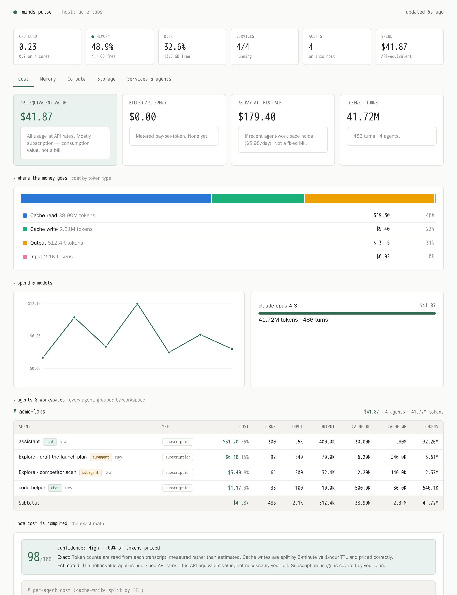

# Minds Pulse

A monitor for your Minds workspace. It shows what your AI is costing you and what your machine is doing, live, in one dashboard.

*The Cost view, shown with example data.*

## 📊 What it shows

Minds Pulse runs as a tab inside your Minds workspace. A strip across the top gives you the one-glance vitals. Everything else sits behind tabs so it stays clean.

- **Cost.** Live AI spend, split per agent and per workspace, priced straight from each agent's transcripts. You see the formula and a confidence score, not only a dollar figure.
- **Memory.** Usage, pressure, the heaviest processes, and the OOM log (what got killed when memory ran low, which is the usual reason something crashes).
- **Compute.** Load per core, CPU over time, and the top processes.
- **Storage.** Disk usage, and what is actually growing.
- **Services and agents.** Every background service with live CPU and memory, plus the agents running on the host.

It reads local files and samples the process table. No external calls, no LLM calls, no credentials.

## 🧠 Why it looks the way it does

This began as a plain ask. "Track my AI usage across Minds and tell me what it costs, in real time." Getting to a number worth trusting took a few decisions, and those shaped the whole design.

**The data was already there.** Every Minds agent writes a transcript with exact token counts per message. So Minds Pulse reads the real numbers and prices them with the same rate table Minds bills against. Nothing is guessed.

**Accuracy had to be checked, not assumed.** An early version undercounted by about 7 percent, because it priced every prompt-cache write at the cheap 5-minute rate when 1-hour writes cost double. That is fixed now. The dashboard also shows a confidence score, and it says plainly what is measured (the tokens) versus what is estimated (their dollar value).

**A dollar figure needs honest framing.** Most Minds work runs on a subscription, so the number is what you are consuming at API rates, not a bill. Metered pay-per-token spend is tracked on its own. The dashboard labels which is which, so a big number is never read as an invoice.

**The scary projection was the misleading one.** A plain 30-day forecast stretches today's spend across a month. But building something in Minds is front-loaded. The expensive part is the agent work of creating a tool. Running what you built costs almost nothing, because the finished apps make no model calls. So the projection reads as a provisional pace with a short "build versus run" note, not a fixed monthly bill.

**Cost was only half the story.** A Minds workspace is a small box where memory is the tight resource, and Minds will kill a process when memory runs low. So the tool grew from a cost tracker into a full monitor, which is where the name comes from. It borrows the shape of macOS Activity Monitor but stays quiet on screen. One vitals strip is always up, and the depth is one tab away.

If you adapt this, the ideas worth keeping are simple. Show the math, not only the number. Separate what is measured from what is estimated. Treat cost as a pace, not a bill. Stay thorough without getting noisy.

## ⚙️ How it works

- `libs/minds_pulse/collector.py` reads agent transcripts, groups usage by session (sub-agents included), and prices it with `pricing.py`.
- `libs/minds_pulse/system_monitor.py` samples CPU, memory, disk, services, and the OOM log fresh on each request, keeping a short history for the graphs.
- `libs/minds_pulse/runner.py` is a small Flask app that serves the dashboard and its data. The whole interface is one `assets/index.html`.

## 🚀 Use it

- **Start a new mind from it.** Point a new Minds workspace at this repo's URL. On first boot the mind reads the inspiration and helps you adapt it.
- **Add it to a mind you already have.** Run `/use-inspiration <this repo's URL>`.

## 📦 What's inside

- **Minds Pulse**, with the full write-up in [`inspiration-minds-pulse.md`](inspiration-minds-pulse.md). That file covers what it is, how it works, what it needs (nothing, no credentials), and how to adapt it.

This repo is a published Minds inspiration, a clean and bootable copy of a feature a mind built, ready to adapt into your own. It is not the generic workspace template. It is this one project.

## ⚠️ Good to know

- Prices are copied from the Minds billing table as of publish, so re-sync them if rates change.
- Spend from a metered pay-per-token API, for example browser automation, is not folded into billed spend yet.
- With only a day or two of history, the projection cannot tell a build sprint from steady use, and it says so.
- Agents share a process tree, so the per-agent CPU and memory reads are best effort.
